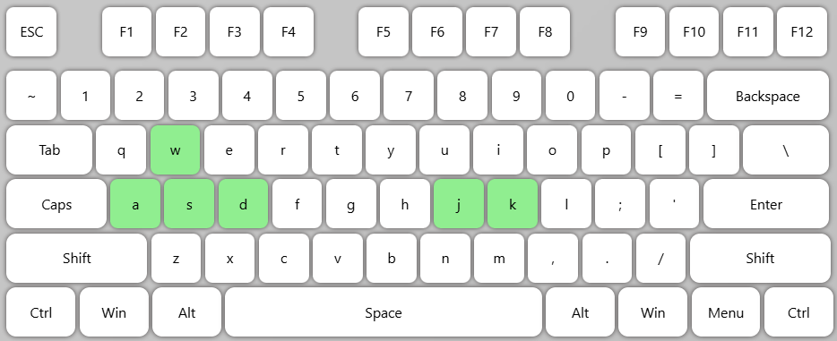
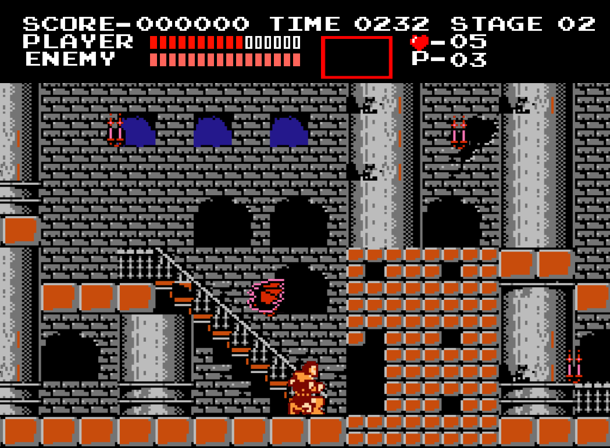

### 國立臺北科技大學
# 2025 資工系物件導向程式設計實習期末報告

## 組別資訊

組別：49

組員：楊君威，黃音慈

復刻遊戲：`Castlevania NES`

## 專案簡介

### 1. 遊戲簡介  
本專案為復刻經典紅白機動作遊戲《惡魔城（Castlevania）》的版本。重現其前三個經典關卡，包含角色控制、掉落道具、敵人、Boss戰、關卡機制與音效特效等，打造具有懷舊風格的挑戰性平台遊戲。

### 2. 組別分工  
本專案由兩位組員共同開發，採取協同設計與任務分工的方式完成。
在主要類別（如 `Character`、`Scene`、`Enemy`）部分，兩人共同討論與撰寫，確保整體邏輯與架構一致。

針對衍生類別，雖屬同一類型功能，但依項目分工實作，例如一人負責角色的跳躍，另一人負責蹲下；敵人如 `Zombie`、`Phantom` 等也依照類型拆分。

兩人皆參與整合、測試與除錯，確保遊戲完整穩定。

---

## 遊戲介紹

### 1. 遊戲規則  

玩家扮演吸血鬼獵人 `Simon Belmont`，使用鞭子與副武器對抗敵人並突破重重關卡。

- 角色攻擊火把，會掉落道具。道具說明請參考第三點。
- 角色攻擊敵人，有機率掉落道具。道具說明請參考第三點，敵人說明請參考第四點。
- 角色碰到敵人，體力扣 `2`，若扣完體力爲零，角色死亡。
- 於 `STAGE2B` ，若角色掉入水中會直接死亡。
- 當角色死亡，生命值扣 `1`，若扣完生命值 `小於` 零，遊戲結束。


### 2. 操作說明

操作方式包括：

- `A`，`D`：左右移動
- `W`，`S`：上下樓梯
- `S`：蹲下
- `K`：跳
- `J`：鞭子攻擊
- `J`+`W`：使用副武器
---
- 

### 3. 道具

道具眾多，以下為前三關中出現的道具。
- [道具說明](Loots.md)

### 4. 敵人

敵人種類繁多，以下為前三關中出現的敵人。
- [敵人說明](Enemies.md)

### 5. Debug 模式

進入 Debug 模式後，遊戲時間暫停，角色不會受傷（若於 `STAGE2B` 掉入水中還是會死亡，但不扣生命值）。
當切換到不同關卡，角色的體力、鞭子等級、副武器，關卡中的火把等皆會重置。

- `6`：切換一般模式與 Debug 模式
- `0`：換到 `Stage 00`
- `1`：換到 `Stage 01`
- `2`：換到 `Stage 02`
- `3`：換到 `Stage 03`
---
- 

---

#### 關卡說明：

- **Stage 00 (Castle Entrance)**  
  - 敵人：無  
  - 簡單關卡，用於學習基本操作與遊戲機制  
  - 以移動為主，無敵人干擾

- **Stage 01 (Entrance Hall)**  
  - 敵人：`Zombie`、`Leopard`  
  - 作為正式進入的起點  
  - 著重於移動與基本攻擊

- **Stage 02 (Crypt)**  
  - 敵人：`Bat`、`Fishman`  
  - 引入場景變換與平台跳躍元素
  - 場景分為 `STAGE2A`、`STAGE2B` 
  - 考驗玩家的反應速度與操控節奏

- **Stage 03 (Phantom Bat)**  
  - 敵人：`Zombie`
  - Boss：`Phantom Bat`  
  - 場景空間狹小，敵人密集  
  - `Boss` 戰，引導玩家使用副武器和躲避敵人攻擊

### 2. 遊戲畫面  





---

## 程式設計

### 1. 程式架構

**類別架構**


**游戲流程**


### 2. 程式技術

#### 1. 物件導向設計（OOP）

本專案廣泛運用物件導向的三大特性：**繼承、封裝、多型**，使各個模組更具擴充性與可維護性。

- **繼承與多型**：
  - `Enemy` 為敵人基底類別，`Zombie`、`Leopard`、`Bat`、`Fishman`、`PhantomBat` 等敵人類別皆繼承自 `Enemy`，並根據不同行為覆寫移動、攻擊、碰撞等函式。
  - `Loot` 為道具基底類別，`Bag`、`Chicken` 等道具、`Whip`、`Axe` 等副武器，皆繼承自 `Loot`，並依照功能實作取得效果（如補血、加分、升級武器等）。
  - `Scene` 為場景基底類別，`Title`、`Stage0 ~ Stage3`、`GG` 等皆繼承自 `Scene`，每個關卡/畫面擁有不同的初始化與顯示邏輯。
  - `SubWeaponBase` 為副武器基底類別，`Axe`、`Dagger`、`HolyWater` 等皆繼承自 `SubWeaponBase`，並實作各自的攻擊邏輯。
- **封裝**：
  - 每個類別的屬性與方法皆封裝在類別內，外部無法直接存取，確保數據安全性。
  - 使用 getter/setter 方法來控制屬性的存取與修改。
- **組合**：
  - `App` 組合了 `Scene`、`Menu`、`Character` 等物件，管理遊戲主流程。
  - `EnemiesManager` 管理所有敵人、敵人死亡後掉落的物件與敵人移動行為。

#### 2. 狀態機行動管理

- **角色**：  
  角色與敵人皆擁有明確的狀態（如 `idle`、`walk`、`jump`、`attack`、`hurt`、`dead`），並根據當前狀態切換對應的動畫與行為邏輯。

- **敵人**：
  - 敵人類別（如 `Leopard`、`Fishman`）皆實作了狀態機，根據當前狀態（如 `idle` `walk`、`attack`、`hurt`、`dead`、`spawn`）切換動畫與行為邏輯。
  - Boss `PhantomBat` 採用階段式狀態設計，包含 `idle`、`fly`、`dive` 等多段攻擊模式，透過狀態切換與時間控制調整戰鬥節奏。

#### 3. 碰撞偵測

- **AABB（Axis-Aligned Bounding Box）碰撞**：  
  所有物件（如角色、敵人、道具、火把、可破壞方塊）皆使用座標與尺寸進行 AABB 碰撞判斷，確認是否發生重疊。

- **事件觸發**：  
  根據碰撞結果，進行對應的遊戲事件處理，例如：
  - 角色受傷或死亡
  - 敵人被擊敗並掉落道具
  - 方塊被擊破後觸發掉落物或特效

#### 4. 事件與時間控制

- **SDL 計時系統**：  
  使用 `SDL_GetPerformanceCounter` 搭配自訂的 `Time::GetRunTimeMs()` 函數，精準控制以下遊戲邏輯中的時間相關行為：
  - 動畫播放速度  
  - 敵人行為間隔  
  - 道具出現與消失時間  

- **冷卻與延遲機制**：  
  遊戲中多處行為皆使用冷卻與延遲設計來維持節奏平衡，例如：
  - 敵人重生時間控制  
  - 道具自動消失時間  
  - Boss（如 `PhantomBat`）狀態切換延遲  

#### 5. 物理運算與數學應用

- **物理運動模擬（速度向量與目標追蹤）**：  
  在 `PhantomBat` 的飛行與俯衝邏輯中，透過計算當前位置與目標位置的距離，推導出速度向量，實現朝目標點的平滑移動。  
  所使用的公式如下：

  - 計算 X 軸速度：
    ```
    vel.x = (pos.x < target.x) ? speed : -speed;
    ```

  - 計算 Y 軸速度（斜率補償）：
    ```
    vel.y = |target.y - pos.y| / (|target.x - pos.x| / |vel.x|);
    vel.y *= (pos.y < target.y) ? 1 : -1;
    ```

  該設計確保 PhantomBat 能夠穩定地朝目標方向移動，不會瞬移或忽快忽慢。

- **三角函數（sin 函數）應用於俯衝攻擊**：  
  在 `Dive()` 中，PhantomBat 的俯衝運動使用正弦函數 `sin()` 產生自然的拋物線效果，模擬類似真實物理的攻擊軌跡。  
  使用的公式如下：

  - 計算俯衝過程中的 Y 軸速度：
    ```
    vel.y = -yDistance × sin(diveTime / tDive × π);
    ```

  其中：
  - `diveTime`：目前經過的時間（模擬進度）
  - `tDive`：俯衝總時間（隨機設定）
  - `yDistance`：從起點到俯衝最低點的距離

  此設計使俯衝過程在速度與視覺上都更流暢自然，並提高遊戲挑戰性與觀賞性。

- **視覺特效中的擺動應用**：  
  類似的 `sin()` 函數也應用於 `Bat`（蝙蝠）與 `Heart`（愛心道具）的移動軌跡，用來產生波浪型或擺動式的運動，使物件移動更具生命感與變化性。


## 結語
### 1. 問題及解決方法
在開發過程中，我們遇到了以下幾個主要問題：
1. **碰撞偵測不準確**：  
  初期實作的 AABB 碰撞偵測存在邊界條件處理不當的問題，導致角色與敵人之間的碰撞判斷不準確。  
  **解決方法**：重新檢視碰撞邏輯，確保所有物件的邊界計算正確，並加入額外的容錯處理。
2. **樓梯與碰撞架構設計困難**：
  樓梯的加入讓角色移動與碰撞判斷變得更複雜，必須考慮角色在樓梯上的特殊狀態（上樓、下樓、轉向、銜接樓梯等），以及與一般地形的切換。  
  **解決方法**：設計專屬的 Stair 類別，並在角色類別中加入樓梯狀態與行為的判斷，明確區分角色在樓梯與地面時的移動、碰撞與動畫切換，並透過狀態機管理不同情境下的行為。
2. **敵人行為不穩定**：
  部分敵人（如 `PhantomBat`）的行為在不同狀態之間切換時存在延遲或不連貫的問題。  
  **解決方法**：調整狀態機邏輯，確保每個狀態之間的切換平滑，並加入時間控制來避免過快切換。
3. **Debug 模式功能不完整**：
  初期的 Debug 模式無法正確切換關卡或重置遊戲狀態。  
  **解決方法**：完善 Debug 模式的實作，確保能夠在不同關卡間切換，並正確重置角色屬性與場景狀態。

### 2. 貢獻比例
- 楊君威（50%）
- 黃音慈（50%）

### 3. 自我檢核表

| 項次 | 項目                                   | 完成 |
|------|---------------------------------------|-------|
| 1    | 這是範例                               |  ✅  |
| 2    | 完成專案權限改為 public                 |  ✅  |
| 3    | 具有 debug mode 的功能                 |  ✅  |
| 4    | 解決專案上所有 Memory Leak 的問題       |  ✅  |
| 5    | 報告中沒有任何錯字，以及沒有任何一項遺漏  |  ✅  |
| 6    | 報告至少保持基本的美感，人類可讀         |  ✅  |

### 4. 收穫

透過本次專案，我們首次挑戰了規模較大的遊戲開發工作，深入理解如何建立清晰且模組化的專案架構。從主流程設計到類別劃分與檔案組織，我們學會了如何規劃大型專案的開發流程，並以物件導向方式完成完整的遊戲邏輯。
我們實際應用了繼承、多型與封裝等核心概念，將 `Enemy`、`Scene`、`Loot` 等模組拆分成可重用的類別，提升了程式的可維護性與擴充性。同時也強化了對狀態機設計、碰撞偵測、動畫控制、事件處理等關鍵技術的理解與實作能力。

### 5. 心得

本次專案讓我們深刻體驗到遊戲開發的樂趣與挑戰。從最初構思遊戲規劃、模仿原作機制，到實際撰寫程式碼並不斷測試與修正，每個階段都需要大量的思考與細節處理。尤其是在還原原作遊戲的節奏與手感時，我們反覆微調角色動作、敵人與物件擺放，只為了追求最接近原作的體驗。
在團隊合作方面，我們練習了如何有效分工協作。在主架構撰寫時共同討論整體流程與邏輯設計，而在細部實作如角色動作與敵人子類時則各自負責，並保持一致的風格與介面。透過這樣的合作方式，不僅提升了開發效率，也加深了我們在程式設計溝通上的默契。
開發過程中，我們也遇到了不少困難，例如碰撞偵測不準、狀態切換錯誤、動畫播放異常等問題。有時一個小錯誤可能需要追蹤許久才能找到原因，但也正是這些挫折，讓我們累積了大量的除錯經驗與系統性思考能力。
我們很開心能夠按時完成對這份作品，雖然只重現了原作的前三關，但我們在過程中融入了自己的設計思維，也更理解經典遊戲背後的設計巧思。這不只是一個專案，更是我們踏出實際開發第一步的寶貴經驗。


### 6. 對於本課程的建議
沒有，謝謝老師及助教們
