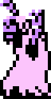
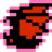
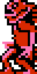
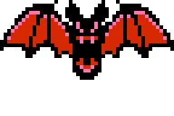

## 敵人說明  
[**返回**](Documentation.md)

### 敵人

| 圖示                                 | 名稱         | 敘述                   | 行為                               |
|--------------------------------------|-------------|------------------------|------------------------------------|
|        | Zombie      | 緩慢移動的基本敵人       | 緩慢直線前進，靠近玩家時造成接觸傷害  |
|       | Leopard     | 敏捷的地面敵人           | 快速奔跑，當接近玩家時會跳躍攻擊     |
|           | Bat         | 飛行型敵人              | 上下波浪飛行，難以預測路線           |
|       | Fishman     | 水中出現的射擊敵人       | 從水中跳出並發射火球攻擊             |

---

### Boss

| 圖示                                 | 名稱         | 敘述             | 行為                          |
|--------------------------------------|-------------|------------------|-------------------------------|
|          | Phantom Bat | 巨型吸血蝙蝠      | 高速飛行，會朝玩家位置俯衝攻擊   |

[**返回**](Documentation.md)
