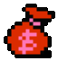

## 道具（Loot）說明
[**返回**](Documentation.md)

#### 一般道具（Standard Items）  

| 圖示                             | 道具名稱       | 效果 / 用途                       |
|----------------------------------|---------------|----------------------------------|
|         | Whip          | 提升主武器（鞭子）等級             |
|      | Small Heart   | 增加 1 個愛心（可用於副武器消耗）   |
|      | Large Heart   | 增加 5 個愛心（可用於副武器消耗）   |
|        | Red Bag       | 增加分數（100 分）                 |
|        | Purple Bag    | 增加分數（400 分）                 |
|        | White Bag     | 增加分數（700 分）                 |

#### 副武器（Subweapons）

| 圖示                              | 副武器名稱    | 效果 / 用途                        |
|-----------------------------------|--------------|-----------------------------------|
|          | Axe           | 拋物線攻擊敵人，可穿透敵人       |
|       | Dagger        | 直線快速投擲攻擊敵人                |
|    | Holy Water    | 投擲後落地產生火焰，持續傷害敵人     |
|    | Stopwatch     | 使用時暫停所有敵人行動數秒           |

#### 特殊道具（Special Items）
| 圖示                             | 道具名稱       | 效果 / 用途                         |
|----------------------------------|---------------|------------------------------------|
|       | Rosary        | 畫面閃爍並消滅所有畫面上的敵人        |
|          | Pot           | 角色短暫隱形，不受敵人傷害            |
|      | Chicken       | 回復體力（+6，角色體力上限 16）   |
|        | Badge         | 顯示徽章動畫，增加成就               |
|        | Special Bag   | 增加大量分數（1000 分）              |
|      | Crystal       | 關卡結束，回滿生命                   |

[**返回**](Documentation.md)