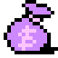
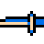

### 道具（Loot）說明
[資料來源](https://strategywiki.org/wiki/Castlevania/Items)

#### 一般道具（Standard Items）  

| 圖示                             | 道具名稱       | 說明          | 效果 / 用途                           |
|----------------------------------|---------------|---------------|--------------------------------------|
|         | Whip          | 鞭子升級道具   | 提升主武器（鞭子）等級                 |
|      | Small Heart   | 副武器彈藥     | 增加 1 個愛心（可用於副武器消耗）   |
|      | Large Heart   | 副武器彈藥     | 增加 5 個愛心（可用於副武器消耗）   |
|        | Red Bag       | 分數袋子       | 增加分數（100 分）                    |
|        | Purple Bag    | 分數袋子       | 增加分數（400 分）                    |
|        | White Bag     | 分數袋子       | 增加分數（700 分）                    |

#### 副武器（Subweapons）

| 圖示                              | 副武器名稱     | 說明            | 效果 / 用途                        |
|-----------------------------------|---------------|----------------|------------------------------------|
|          | Axe           | 副武器：斧頭    | 拋物線攻擊敵人，可穿透部分敵人        |
|       | Dagger        | 副武器：匕首    | 直線快速投擲攻擊敵人                 |
|    | Holy Water    | 副武器：聖水    | 投擲後落地產生火焰，持續傷害敵人      |
|    | Stopwatch     | 副武器：懷錶    | 使用時暫停所有敵人行動數秒           |

#### 特殊道具（Special Items）
| 圖示                             | 道具名稱       | 說明            | 效果 / 用途                         |
|----------------------------------|---------------|-----------------|------------------------------------|
|       | Rosary        | 念珠            | 畫面閃爍並消滅所有畫面上的敵人        |
|          | Pot           | 罐子            | 角色短暫隱形，不受敵人傷害                        |
|      | Chicken       | 烤雞            | 回復生命值（+6，角色生命值上限 16）            |
|        | Badge         | 勳章            | 顯示徽章動畫，增加成就            |
|        | Special Bag   | 特殊分數袋子     | 增加大量分數（1000 分）              |
|      | Crystal       | 關卡通關水晶     | 關卡結束，回滿生命                   |

[**返回**](Documentation.md)